#  DOCKER 

## Docker login
docker login komutu, Docker Hub veya özel bir Docker registry'ye giriş yapmak için kullanılır. Bu işlem, Docker imajlarını çekmek (pull) veya yüklemek (push) gibi işlemler yapabilmek için gereklidir. Komut, kullanıcının Docker'a kimlik doğrulaması yapmasını sağlar.

--username veya -u parametresi, Docker Hub veya registry üzerindeki kullanıcı adını belirtir.
--password veya -p parametresi, kullanıcı şifresini belirtir.
```
docker login   --username emreeozll   --password 123456789

docker login   -u  emreeozll    -p  123456789
```
<br></br>

## Nginx
Bu komut, Docker ile bir nginx konteyneri başlatır ve bu konteynerin içindeki web sunucusunun 80 numaralı portunu, dışarıya 9991 numaralı port üzerinden erişilebilir hale getirir.

Komutun her bir parametresi şu şekilde çalışır:

- docker run: Yeni bir Docker konteyneri başlatmak için kullanılır.
-  -it: Interaktif modda çalıştırmak ve terminal (TTY) bağlamak için kullanılır. Bu, konteynerin içinde komut satırına erişmenizi sağlar.
- -d: Konteyneri arka planda çalıştırmak için kullanılır (detached mode).
- -p 9991:80: Dışarıdaki 9991 numaralı portu, konteynerdeki 80 numaralı porta yönlendirir. Yani, yerel makinenizde http://localhost:9991 adresine gittiğinizde, Docker konteynerindeki nginx sunucusuna erişirsiniz.
- --name my-nginx: Başlatılan konteynere my-nginx adını verir.
- nginx: Çalıştırılacak Docker imajıdır. Burada nginx imajı, web sunucusu olarak kullanılacak.

```
docker run  -it   -d   -p 9991:80   --name my-nginx     nginx
```
<br></br>

## Postgres
Bu komut, Docker üzerinde bir PostgreSQL veritabanı konteyneri çalıştırır. Detaylı açıklaması şu şekildedir:

- docker run: Yeni bir Docker konteyneri başlatır.
- --name my-postgres: Konteynere my-postgres adını verir.
- -p 9999:5432: Konteynerdeki PostgreSQL veritabanının 5432 portunu, dışarıdaki 9999 portuna yönlendirir. Böylece, localhost:9999 adresinden PostgreSQL veritabanına erişebilirsiniz.
- -e POSTGRES_PASSWORD=123456789: PostgreSQL veritabanı için postgres kullanıcısının şifresini 123456789 olarak ayarlar.
- -d: Konteyneri arka planda çalıştırır (detached mode).
- postgres: PostgreSQL veritabanı imajını kullanarak konteyneri çalıştırır.
```
docker run  --name my-postgres   -p 9999:5432  -e POSTGRES_PASSWORD=123456789  -d  postgres
```
<br></br>

## Mysql
Bu komut, Docker üzerinde bir MySQL veritabanı konteyneri çalıştırır. Kısaca açıklaması:

- docker run: Yeni bir Docker konteyneri başlatır.
- --name my-mysql: Konteynere my-mysql adını verir.
- -p 9990:3306: Konteynerdeki MySQL veritabanının 3306 portunu, dışarıdaki 9990 portuna yönlendirir. Bu sayede, localhost:9990 adresi üzerinden MySQL veritabanına erişebilirsiniz.
- -e MYSQL_ROOT_PASSWORD=123456789: MySQL veritabanının root kullanıcısının şifresini 123456789 olarak ayarlar.
- -d: Konteyneri arka planda çalıştırır (detached mode).
- mysql: MySQL veritabanı imajını kullanarak konteyneri çalıştırır.
```
docker run  --name my-mysql      -p 9990:3306  -e MYSQL_ROOT_PASSWORD=123456789 -d  mysql 
```

<br></br>

## Docker Container Konfigürasyon 

```
# Uygulama için gerekli olan JDK sürümünü belirt
# Amazon Corretto JDK sürüm 17 veya OpenJDK 17 kullanıyoruz
# FROM amazoncorretto:17
FROM openjdk:17

# Projenin JAR dosyasının konumunu tanımla
ARG JAR_FILE=target/*.jar

# JAR dosyasını Docker konteynerine belirli bir isimle kopyala
COPY ${JAR_FILE} devops-hello-app.jar

# CMD komutunu kullanarak kurulum sırasında gereken herhangi bir komutu çalıştır
CMD apt-get update
CMD apt-get upgrade -y

# İç portu düzeltmek için 8080 portunu dışa aç
EXPOSE 8080

# Uygulamayı çalıştıracak komut
ENTRYPOINT ["java","-jar","devops-hello-app.jar"]
```

## Docker Container İsim Değiştirme
docker container rename my-app5 my-app1 komutu, Docker konteynerinin adını değiştirmek için kullanılır.

- my-app5: Eski konteyner adı.
- my-app1: Yeni konteyner adı.
```
docker container rename my-app5 my-app1
```


## Docker Container Push
Yerel makinenizdeki bir Docker imajını Docker Hub üzerindeki bir repository'ye yükler.

- docker.io/emreeoozell/devops-application-001
: Yüklenmek istenen Docker imajının adı ve etiketi.
- docker.io: Docker Hub'ın genel registry adresi.
- emreeoozell: Docker Hub kullanıcı adı.
- devops-application-001: İmaj adı.
- v002: İmajın etiketi (version 002).
```
docker image push docker.io/emreeoozell/devops-application-001:v002
```
## Jar Paketini Docker Image Alma
### Sürüm Yüklenmesi ve Tekrar Güncelleme
Bu üç komut, Docker imajlarını farklı etiketlerle oluşturur:

- İlk komut, devops-001-hello-1.0.1.jar dosyasını kullanarak v001 etiketiyle bir Docker imajı oluşturur.
- İkinci komut, devops-001-hello-1.0.2.jar dosyasını kullanarak v002 etiketiyle bir Docker imajı oluşturur.
- Üçüncü komut, aynı devops-001-hello-1.0.2.jar dosyasını kullanarak latest etiketiyle bir Docker imajı oluşturur.


```
docker build  --build-arg JAR_FILE=target/devops-001-hello-1.0.1.jar   --tag    emreeozll/devops-001-hello:v001   .

docker build  --build-arg JAR_FILE=target/devops-001-hello-1.0.2.jar   --tag    emreeozll/devops-001-hello:v002   .

docker build  --build-arg JAR_FILE=target/devops-001-hello-1.0.2.jar   --tag    emreeozll/devops-001-hello:latest   .
```

## Docker Image Container Olarak Çalıştırma

Bu beş docker run komutu, emreeozll/devops-001-hello imajını farklı portlar ve etiketlerle çalıştırarak beş ayrı konteyner başlatır:

- my-app1: 8081 portunu 8080'a yönlendirerek, imajın en son sürümüyle konteyneri başlatır.
- my-app2: 8082 portunu 8080'a yönlendirerek aynı imajla başka bir konteyner başlatır.
- my-app3: 8083 portunu 8080'a yönlendirerek, v001 etiketiyle belirli bir sürümle konteyneri başlatır.
- my-app4: 8084 portunu 8080'a yönlendirerek, v002 etiketiyle farklı bir sürümle konteyner başlatır.
- my-app5: 8085 portunu 8080'a yönlendirerek, latest etiketiyle en güncel sürümle konteyneri başlatır. 
<br></br>
 Her komut farklı portlarda çalışan konteynerler oluşturut.
```
docker run     -it     -d     -p 8081:8080     --name my-app1      emreeozll/devops-001-hello

docker run     -it     -d     -p 8082:8080     --name my-app2      emreeozll/devops-001-hello

docker run     -it     -d     -p 8083:8080     --name my-app3      emreeozll/devops-001-hello:v001

docker run     -it     -d     -p 8084:8080     --name my-app4      emreeozll/devops-001-hello:v002

docker run     -it     -d     -p 8085:8080     --name my-app5      emreeozll/devops-001-hello:latest
```

http://localhost:8081 </br>
http://localhost:8082 </br>
http://localhost:8083 </br>
http://localhost:8084 </br>
http://localhost:8085 </br>


##  Docker Hub'dan Image Alma
Bu üç docker pull komutu, Docker Hub'dan emreeoozell/devops-application-001 imajının farklı etiketleriyle çekilmesini sağlar:

- docker pull emreeoozell/devops-application-001:v001: v001 etiketiyle devops-application-001 imajını çeker.
- docker pull emreeoozell/devops-application-001:v002: v002 etiketiyle devops-application-001 imajını çeker.
- docker pull emreeoozell/devops-application-001:latest: latest etiketiyle en güncel sürümünü çeker.
<br></br>
Her komut, belirtilen etiketle Docker Hub'dan ilgili imajı yerel makinenize indirir.

```
docker pull emreeoozell/devops-application-001:v001

docker pull emreeoozell/devops-application-001:v002

docker pull emreeoozell/devops-application-001:latest
```

<br></br>

## Docker Network
### 1. Network Listeleme
* `docker network ls` komutu, Docker hostunda mevcut olan tüm ağları (networks) listelemek için kullanılır. Bu komut, her ağın adını, ID'sini, sürümünü (driver) ve diğer ilgili bilgileri gösterir.
```
docker network ls
```

### 2. Yeni Bir Network Oluşturma
* `docker network create my-network` komutu, **my-network** adında yeni bir Docker ağı oluşturur. Bu ağ, konteynerlerin birbirleriyle iletişim kurabilmesi için kullanılır. Docker konteynerlerini bu ağa bağlayarak, onları izole edebilir veya özel bir ağ üzerinde iletişim kurmalarını sağlayabilirsiniz.
```
docker network create my-network
```

### 3.  Network Tipini Değiştirmek İçin  "--driver" Parametresi Kullanma
* Bu komut, --driver parametresi ile host tipinde bir Docker ağı oluşturur. Host ağı, konteynerin doğrudan ana makinenin ağını kullanmasını sağlar, yani konteyner ve ana makine aynı IP adresini paylaşır. Bu, konteynerlerin daha hızlı iletişim kurmasını sağlarken, ağ izolasyonunu devre dışı bırakır.
```
docker network create --driver host
```

<br></br>
##  Network Bilgisi Öğrenme ve Detaylı Bilgiler
* docker network inspect my-network komutu, my-network adlı Docker ağının detaylı bilgilerini gösterir. Bu bilgiler arasında ağ ayarları, IP aralığı, kullanılan sürücü (driver) ve bu ağa bağlı olan konteynerlerin listesi yer alır.
```
docker network inspect my-network
```

Bu komutlar, bir Docker ağına konteyner ekleme, çıkarma, ağı inceleme ve silme işlemlerini gerçekleştirir:

 ## 1. Network'e Konteyner Ekleme
   ```
   docker network connect my-network my-app1
   docker network connect my-network my-app2
   docker network connect my-network my-app3
   docker network connect my-network my-app4
   ```
   - **my-network** ağına belirtilen konteynerleri (my-app1, my-app2, my-app3, my-app4) bağlar.

## 2. Network Bilgisi ve Konteynerleri Görüntüleme
   ```
   docker network inspect my-network
   ```
   - **my-network** ağının yapılandırma bilgilerini ve bağlı konteynerleri gösterir.

## 3. Network'ten Konteyner Çıkarma 
   ```
   docker network disconnect my-network my-app4
   ```
   - **my-app4** konteynerini **my-network** ağından çıkarır.

## 4. Network Silme
   ```
   docker network rm my-network
   ```
   - **my-network** ağını tamamen siler. (Ağda konteyner olmamalı.)


<br></br>

 ## Docker Volume 
 Bu komutlar, Docker'da volume yönetimi için kullanılır:

1. **Volume listeleme**:
   ```bash
   docker volume ls
   ```
   - Mevcut tüm Docker volumelerini (depolama birimlerini) listeler.

2. **Yeni volume oluşturma**:
   ```bash
   docker volume create my-volume
   ```
   - **my-volume** adında yeni bir Docker volume oluşturur.

3. **Volume inceleme**:
   ```bash
   docker volume inspect my-volume
   ```
   - **my-volume** hakkında detaylı bilgi verir (konumu, sürücüsü vb.).

4. **Volume silme**:
   ```bash
   docker volume rm my-volume
   ```
   - **my-volume** adlı Docker volumeyi siler.

5. **Kullanılmayan volumeleri silme**:
   ```bash
   docker volume prune
   ```
   - Kullanılmayan tüm volumeleri temizler, sistemde yer açar.

<br></br>

## Docker Compose 
Bu komutlar, `docker-compose` ile konteynerleri başlatma, izleme ve durdurma işlemlerini gerçekleştirir:

1. **Konteynerleri başlatma**:
   ```bash
   docker compose -f docker-compose.yml up
   ```
   - `docker-compose.yml` dosyasındaki tanımlara göre tüm servislere ait konteynerleri başlatır.

2. **Konteynerleri listeleme**:
   ```bash
   docker ps
   docker container ls
   ```
   - Çalışmakta olan tüm konteynerleri gösterir.

3. **Konteyner loglarını görüntüleme**:
   ```bash
   docker-compose logs mongo
   docker-compose logs -f mongo
   ```
   - **mongo** servisine ait logları gösterir. `-f` ile canlı (gerçek zamanlı) log akışı sağlar.

4. **Konteynerleri durdurma ve kaldırma**:
   ```bash
   docker compose -f docker-compose.yml down
   ```
   - Tüm çalışmakta olan konteynerleri durdurur ve siler.
<br></br>

``` yaml
version: "3"
services:

  java:
    build:
      context: ./
    ports:
      - "8080:8080"
    links:
      - mongo
    depends_on:
      - mongo
    networks:
      - shared-net

  mongo:
    image: 'mongo'
    ports:
      - 27017:27017
    hostname: mongo
    volumes:
      - ./data/db:/data/db
    networks:
      - shared-net

networks:
  shared-net:
    driver: bridge
```


<br></br>
<br></br>
## Docker Compose ELK Konfigürasyon
``` yaml
version: '3'

networks:
  elk:

volumes:
  elasticsearch:
    driver: local

services:

  elasticsearch:
    environment:
      http.host: 0.0.0.0
      transport.host: 127.0.0.1
    image: docker.elastic.co/elasticsearch/elasticsearch:6.2.1
    networks:
      elk: null
    ports:
    - 9200:9200
    restart: unless-stopped
    volumes:
    - elasticsearch:/usr/share/elasticsearch/data:rw

  logstash:
    image: docker.elastic.co/logstash/logstash-oss:6.2.1
    depends_on:
    - elasticsearch
    networks:
      elk: null
    ports:
    - 5044:5044
    restart: unless-stopped
    volumes:
    - ./etc/logstash/pipeline:/usr/share/logstash/pipeline:ro

  kibana:
    depends_on:
    - elasticsearch
    environment:
      ELASTICSEARCH_PASSWORD: changeme
      ELASTICSEARCH_URL: http://elasticsearch:9200
      ELASTICSEARCH_USERNAME: elastic
    image: docker.elastic.co/kibana/kibana-oss:6.2.1
    networks:
      elk: null
    ports:
    - 5601:5601
    restart: unless-stopped
```
<br></br>
<br></br>


## Docker Compose RabbitMQ
``` yaml
version: "3.9"

services:

  rabbitmq:
    image: rabbitmq:3-management
    container_name: rabbitmq-1
    ports:
      - 5672:5672
      - 15672:15672
    environment:
      - "RABBITMQ_DEFAULT_PASS=admin"
      - "RABBITMQ_DEFAULT_USER=admin"
      - "RABBITMQ_DEFAULT_VHOST='vhost'"
    volumes:
      - rabbitmq_data:/var/lib/rabbitmq
volumes:
  rabbitmq_data:
```
<br></br>
## MINIKUBE 
Bu komutlar Minikube kümesini başlatma ve Kubernetes podlarını listeleme işlemlerini içerir:

1. **Minikube kümesini başlatma**:
   ```bash
   minikube start
   ```
   - Minikube üzerinde bir Kubernetes kümesi başlatır.

2. **Kubernetes kümesindeki tüm namespace’lerdeki podları listeleme (bulut ortamında)**:
   ```bash
   kubectl get po -A
   ```
   - Kubernetes kümesindeki tüm namespace’lerde bulunan podları listeler.

3. **Minikube üzerinde tüm namespace’lerdeki podları listeleme (yerel ortamda)**:
   ```bash
   minikube kubectl -- get po -A
   ```
   - Minikube ile çalışan tüm podları tüm namespace’lerde gösterir.
### Minikube Dashboard
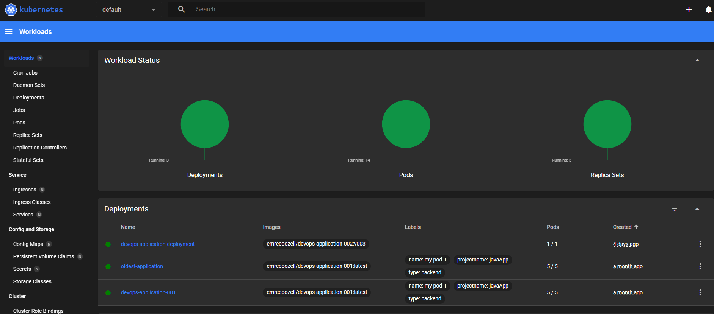
<br></br>
1. Bu komut, varsayılan web tarayıcınızda Kubernetes panosunu başlatır ve küme kaynaklarını izlemek ve yönetmek için grafiksel bir arayüz sağlar.

2. Pano, dağıtımlar, hizmetler ve pod'lar gibi Kubernetes kaynaklarını kullanıcı dostu bir şekilde görüntülemenize, oluşturmanıza ve yönetmenize olanak tanır.
<br></br>
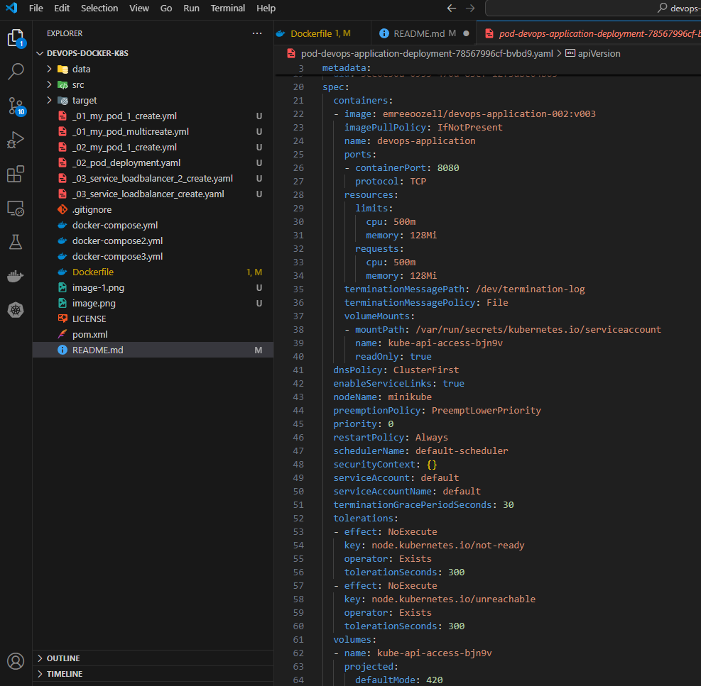

<br></br>


## KUBERNETES 
Bu komutlar Kubernetes kümesindeki temel işlemleri kısaca açıklar:

1. **Kubernetes Sürümünü Kontrol Etme**:
   ```bash
   kubectl version
   ```
   - Hem istemci (client) hem de sunucu (server) için kullanılan Kubernetes sürümünü görüntüler.

2. **Geçerli Ad Alanında Pod'ları Listeleme**:
   ```bash
   kubectl get pod
   ```
   - Geçerli ad alanında çalışan tüm pod'ları gösterir.

3. **Docker Hub'dan Görüntü Çekme ve Kapsayıcı Olarak Çalıştırma**:
   ```bash
   docker run -it -d -p 8085:8080 --name my-app5 emreeozll/devops-01-hello:latest
   ```
   - Docker Hub’dan `emreeozll/devops-01-hello:latest` görüntüsünü indirir ve `my-app5` adlı bir kapsayıcı olarak çalıştırır. Yerel makinede 8085 portuna yönlendirir.

4. **Kubernetes Pod'larında Docker Hub Görüntülerini Kapsayıcı Olarak Çalıştırma**:
   ```bash
   kubectl run my-pod1 --image=emreeozll/devops-01-hello:latest
   kubectl run my-pod2 --image=emreeozll/devops-01-hello:v01
   kubectl run my-pod3 --image=emreeozll/devops-01-hello:v002
   kubectl run my-pod4 --image=emreeozll/devops-01-hello:v002
   kubectl run my-pod5 --image=emreeozll/devops-01-hello:latest
   kubectl run my-pod6 --image=emreeozll/devops-01-hello:latest
   kubectl run my-pod7 --image=emreeozll/devops-01-hello:v003
   kubectl run my-pod8 --image=mysql
   kubectl run my-pod9 --image=postgres
   ```

5. **Düğümleri Görüntüleme**:
   ```bash
   kubectl get nodes
   ```
   - Kubernetes kümesindeki tüm düğümleri (node) ve durumlarını listeler.

6. **Pod'ları Görüntüleme**:
   ```bash
   kubectl get pods
   ```
   - Geçerli ad alanındaki tüm pod'ları gösterir. Tüm ad alanlarındaki pod'ları görmek için `-A` bayrağını kullanabilirsiniz (`kubectl get pods -A`).

7. **Bir Pod'u Silme**:
   ```bash
   kubectl delete pod my-pod8
   ```
   - `my-pod8` adlı pod'u Kubernetes kümesinden siler.

<br></br>
## Manifest Dosyasıyla Bir Kubernetes Pod Oluşturma
Aşağıdaki YAML yapılandırma dosyası, adlı bir Kubernetes pod'unu tanımlar devops-01-hello. Bu pod, görüntüyü kullanarak bir konteyner çalıştırır asoner01/devops-01-hello.<br></br>


* Bu komut, pod.yaml dosyasındaki YAML yapılandırmasını kullanarak Kubernetes kümesinde bir Pod oluşturur. **_01_my_pod_1_create.yaml** adlı dosyada, Pod'un adı, imajı, portları gibi özellikler tanımlanmıştır.
**kubectl apply -f _01_my_pod_1_create** komutu, dosyadaki tanıma göre kümede Pod'u oluşturur veya günceller.
Bu sayede, tanımlanan Pod, kümede çalışmaya başlar.<br> </br>
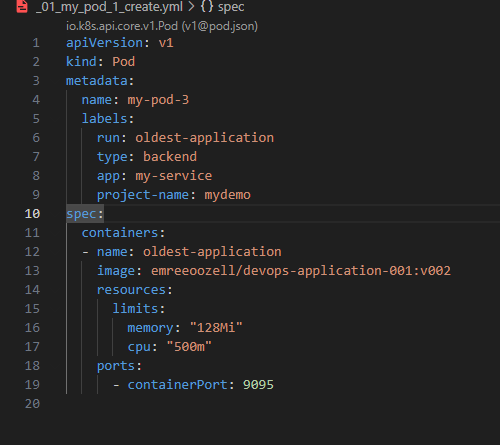
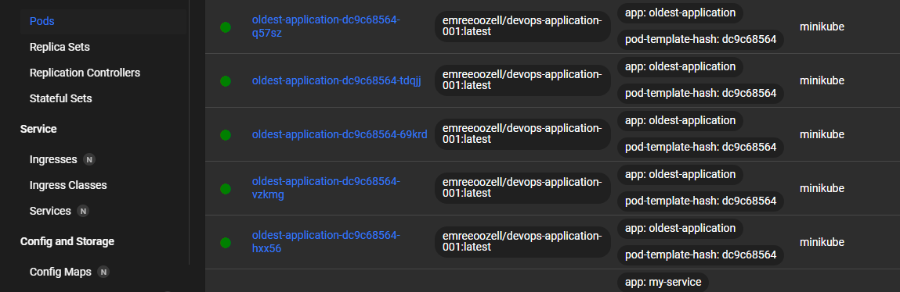 <br>
Bu görüntü, Kubernetes kümesindeki tüm çalışan pod'ları görüntüler.

Açıklama: Meta Veri: Pod adını (devops-01-hello) ve pod'u kategorize etmek ve tanımlamak için etiketleri belirtir. Kapsayıcı Yapılandırması:

Resim: Docker Hub'dan asoner01/devops-01-hello resmini kullanır.
Kaynaklar: Bellek kullanımını 128 Mi ve CPU kullanımını 500 m ile sınırlayarak küme içindeki kaynak tüketimini yönetmeye yardımcı olur.
Portlar: Konteyner içindeki 9095 portunu açığa çıkarır.

## Bir Manifest Dosyasıyla Birden Fazla Kubernetes Pod'u Oluşturma
Aşağıdaki YAML yapılandırma dosyası iki Kubernetes pod'u tanımlar: devops-01-hellove my-new-pod2. Her pod, belirli kaynak sınırları ve açık bağlantı noktaları olan bir kapsayıcıyı çalıştırır.

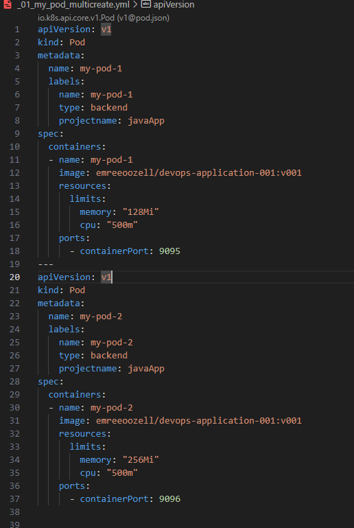

<br></br>

## Manifest Dosyasıyla Kubernetes Dağıtımı Oluşturma
Aşağıdaki YAML yapılandırma dosyası, adlı bir Kubernetes Dağıtımını tanımlar devops-01-hello. Bu dağıtım, ölçeklenebilirlik ve yüksek kullanılabilirlik için bir dizi özdeş pod kopyasını yönetir.

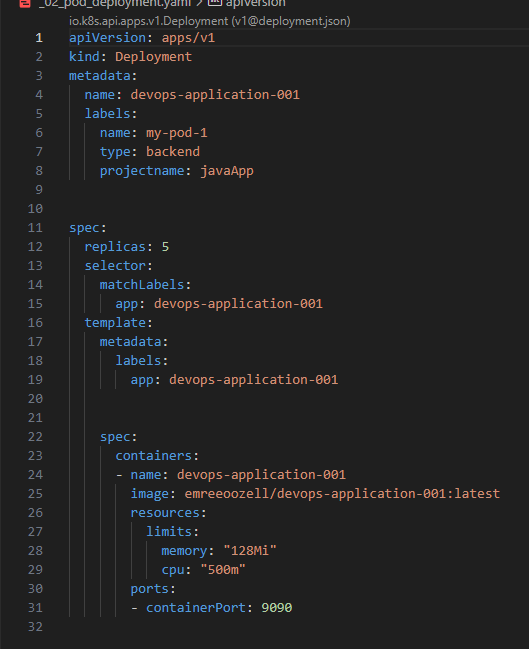
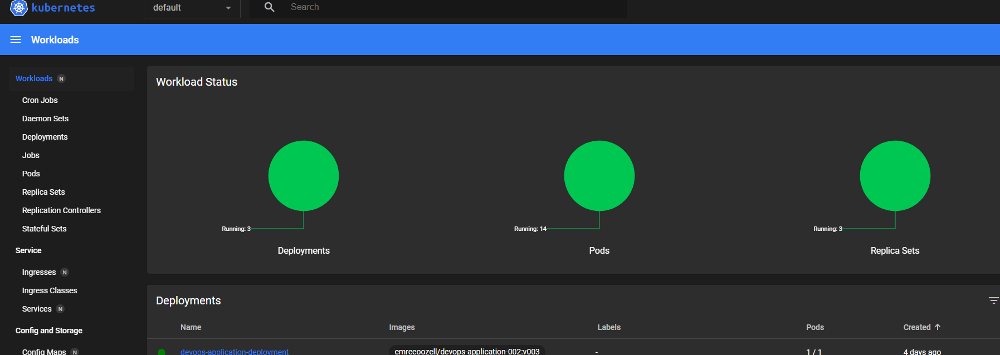
* Bu ekran görüntüsü, replika sayısı da dahil olmak üzere etkin dağıtımları gösterir. <br></br>

## Bir Manifest Dosyasıyla Kubernetes LoadBalancer Hizmeti Oluşturma
Aşağıdaki YAML yapılandırma dosyası, trafiği etiketli pod'lara dağıtan bir Kubernetes Servicetürünü tanımlar .LoadBalancerapp: devops-01-hello>

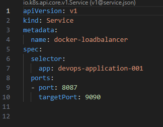
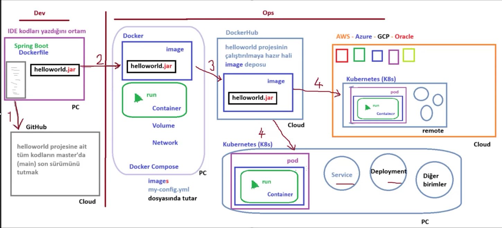
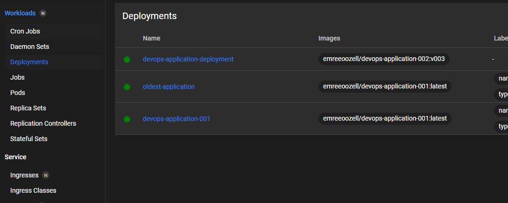
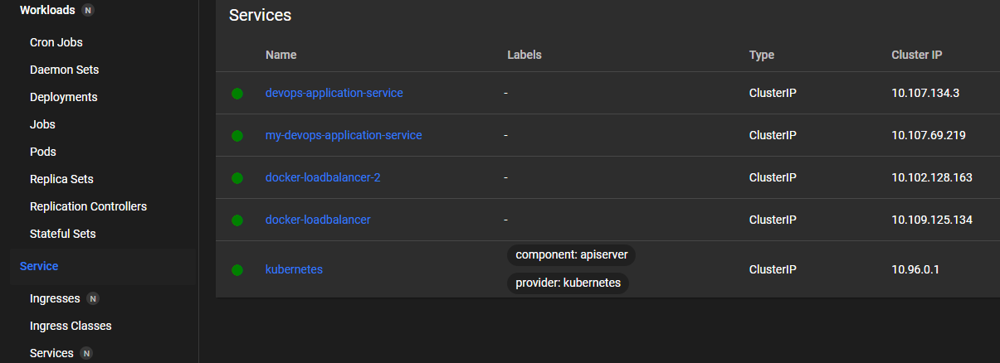